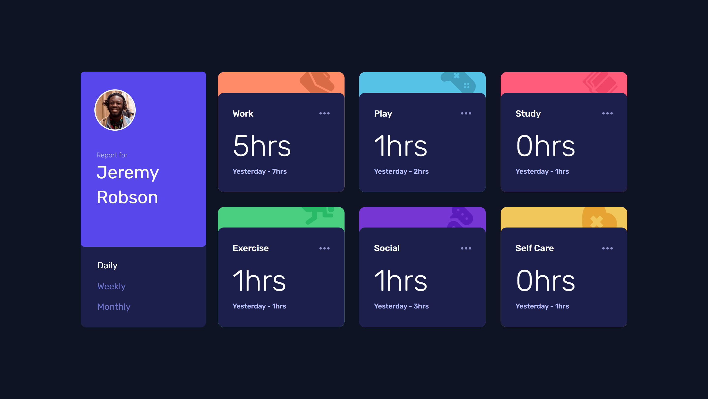
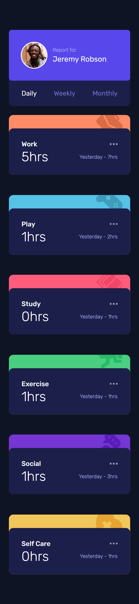

# Frontend Mentor - Time Tracking Dashboard

Uma solução para o desafio [Time Tracking Dashboard](https://www.frontendmentor.io/challenges/time-tracking-dashboard-UIQ7167Jw) do Frontend Mentor.

Este projeto foi desenvolvido como parte da minha retomada aos estudos de desenvolvimento front-end, com foco em praticar React, TypeScript, Tailwind CSS e desenvolvimento responsivo.

## Índice

- [Visão geral](#visão-geral)
  - [O desafio](#o-desafio)
  - [Screenshot](#screenshot)
  - [Links](#links)
- [Meu processo](#meu-processo)
  - [Tecnologias utilizadas](#tecnologias-utilizadas)
  - [O que aprendi](#o-que-aprendi)
  - [Desenvolvimento futuro](#desenvolvimento-futuro)
  - [Recursos úteis](#recursos-úteis)
  - [Colaboração com IA](#colaboração-com-ia)
- [Autor](#autor)
- [Agradecimentos](#agradecimentos)

## Visão geral

### O desafio

O objetivo do desafio era construir um dashboard de acompanhamento de tempo a partir do design fornecido pelo Frontend Mentor.

O usuário deve ser capaz de:

- Visualizar o layout ideal da aplicação de acordo com o tamanho da tela;
- Visualizar os estados de hover dos elementos interativos;
- Alternar entre as estatísticas:
  - Daily;
  - Weekly;
  - Monthly.
- Visualizar os dados correspondentes ao período selecionado.

### Screenshot
#### Desktop


#### Mobile


### Links

- [Desafio no Frontend Mentor](https://www.frontendmentor.io/challenges/time-tracking-dashboard-UIQ7167Jw)
- Solution URL: **adicione aqui o link da sua solução no Frontend Mentor**
- Live Site URL: [Acessar](https://isabela-fernanda.github.io/time-tracking-dashboard/)

## Meu processo

### Tecnologias utilizadas

- HTML5 semântico
- TypeScript
- React
- Vite
- Tailwind CSS
- CSS Grid
- Flexbox
- Design responsivo
- Abordagem Mobile First
- Git e GitHub

### O que aprendi

Este projeto foi principalmente uma oportunidade para retomar a prática de desenvolvimento front-end e me atualizar com ferramentas e práticas que não utilizava há algum tempo.

#### Componentização com React

Uma das principais mudanças em relação à forma como eu costumava desenvolver projetos foi pensar a interface como uma composição de componentes reutilizáveis.

O dashboard foi dividido principalmente entre:

- `UserProfile` — informações do usuário e seleção do período;
- `TimeCard` — cartão responsável por apresentar cada atividade;
- `App` — responsável por controlar o período selecionado e organizar os componentes.

Em vez de criar seis cartões diferentes, os cartões são gerados a partir dos dados:

```tsx
{activities.map((activity) => (
    <TimeCard
        key={activity.title}
        activity={activity}
        period={period}
    />
))}
```

Isso permitiu que o mesmo componente fosse utilizado para todas as atividades.

#### Tipagem com TypeScript

Também pratiquei a utilização de tipos para representar os dados da aplicação.

Por exemplo, cada atividade possui três períodos:

```ts
export type Period = "daily" | "weekly" | "monthly";

export type Timeframe = {
    current: number;
    previous: number;
};

export type Activity = {
    title: ActivityTitle;
    timeframes: Record<Period, Timeframe>;
}; 
```

Isso ajudou a evitar valores inválidos e tornou mais explícita a estrutura dos dados utilizados pelos componentes.

#### Separação entre dados e apresentação

Outra parte importante foi separar os dados fornecidos pelo desafio da configuração visual dos componentes.

As informações das atividades ficam no `data.json`, enquanto ícones e cores são associados através de uma configuração própria:

```ts
export const activityConfig: Record<ActivityTitle, ActivityConfig> = {
    Work: {
        icon: WorkIcon,
        color: "bg-orange-300",
    },
    // ...
}; 
```

Dessa forma, o `TimeCard` não precisa conhecer individualmente cada atividade.

Estado no React

O período selecionado é controlado pelo `App`:

```ts
const [period, setPeriod] = useState<Period>("daily");
```

O `UserProfile` altera esse estado, enquanto os `TimeCard` recebem o período atual e exibem os dados correspondentes.

Isso foi uma boa oportunidade para praticar o fluxo de dados entre componentes através de props.

#### Tailwind CSS

Também retomei o uso de CSS através de Tailwind, utilizando classes utilitárias para construir o layout e os estados responsivos.

O projeto utiliza uma abordagem Mobile First e adapta a organização dos componentes para telas maiores através dos breakpoints do Tailwind.

### Desenvolvimento futuro

Apesar de o desafio estar concluído, alguns pontos podem ser aprimorados em projetos futuros:

- Aprofundar o uso de React e seus padrões de componentização;
- Explorar melhor os recursos de TypeScript;
- Melhorar a organização e reutilização das classes do Tailwind;
- Praticar acessibilidade e navegação por teclado;
- Adicionar testes aos componentes;
- Continuar praticando layouts responsivos com diferentes designs;
- Explorar animações e transições de forma mais consistente.

O principal objetivo dos próximos projetos será continuar praticando enquanto avanço gradualmente para aplicações mais complexas.

### Recursos úteis
[Frontend Mentor](https://www.frontendmentor.io/) — plataforma utilizada para o desafio e para prática de desenvolvimento front-end.
[React](https://react.dev/) — documentação oficial do React.
[TypeScript](https://www.typescriptlang.org/) — documentação oficial do TypeScript.
[Vite](https://vite.dev/) — ferramenta utilizada para desenvolvimento e build da aplicação.
[Tailwind CSS](https://tailwindcss.com/) — framework utilizado para estilização.

### Colaboração com IA

Durante o desenvolvimento deste projeto, utilizei o ChatGPT como ferramenta de apoio ao aprendizado.

A IA foi utilizada principalmente para:

- Revisar decisões de arquitetura e componentização;
- Esclarecer conceitos e recursos atuais do ecossistema - React/TypeScript;
- Auxiliar na identificação e correção de erros de - - - TypeScript;
- Discutir diferentes formas de estruturar os dados da aplicação;
- Revisar e melhorar a implementação dos componentes;
- Auxiliar na construção do layout responsivo;
- Servir como apoio durante a retomada dos estudos após um período sem programar.

A implementação, decisões finais e ajustes visuais foram realizados e revisados por mim.

## Autor
- Frontend Mentor - [Isabela Fernanda](https://www.frontendmentor.io/profile/Isabela-Fernanda)
- GitHub - [Isabela Fernanda](https://github.com/Isabela-Fernanda)

## Agradecimentos

Agradeço ao [Frontend Mentor](https://www.frontendmentor.io/) pelo desafio e pelos designs utilizados como referência.

Também utilizei o ChatGPT como ferramenta de apoio durante o desenvolvimento e, principalmente, como uma forma de revisar conceitos enquanto retomava a prática de programação.